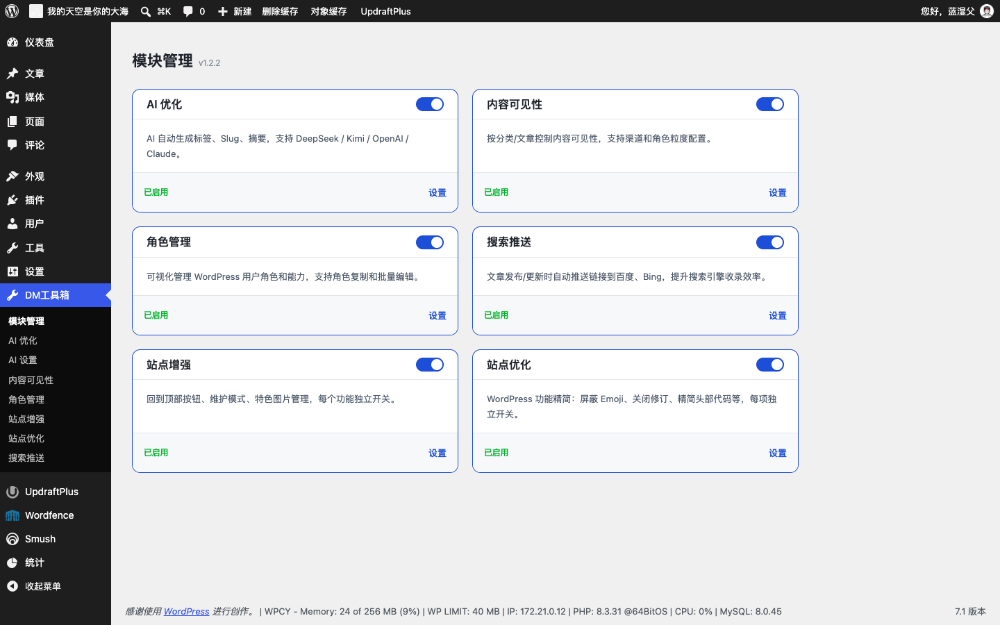
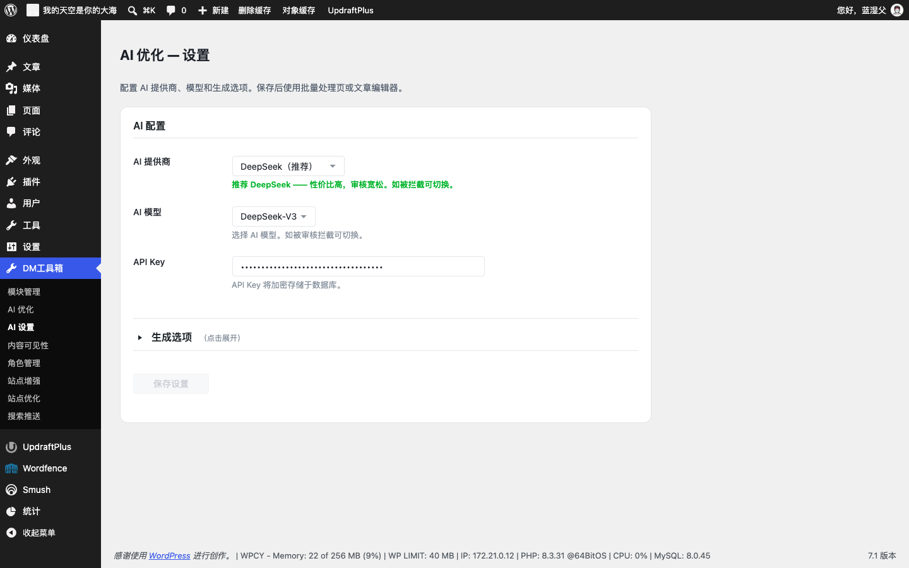
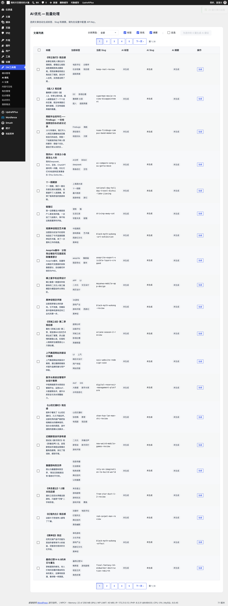
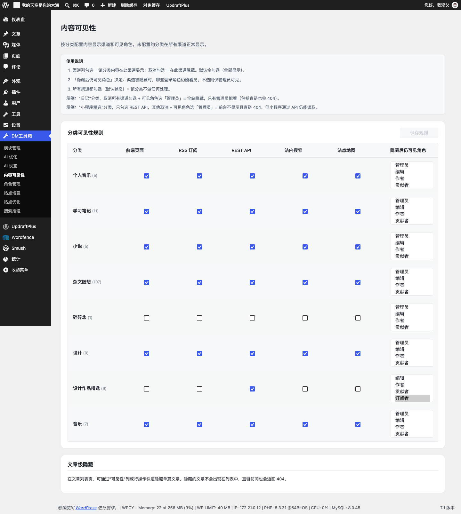
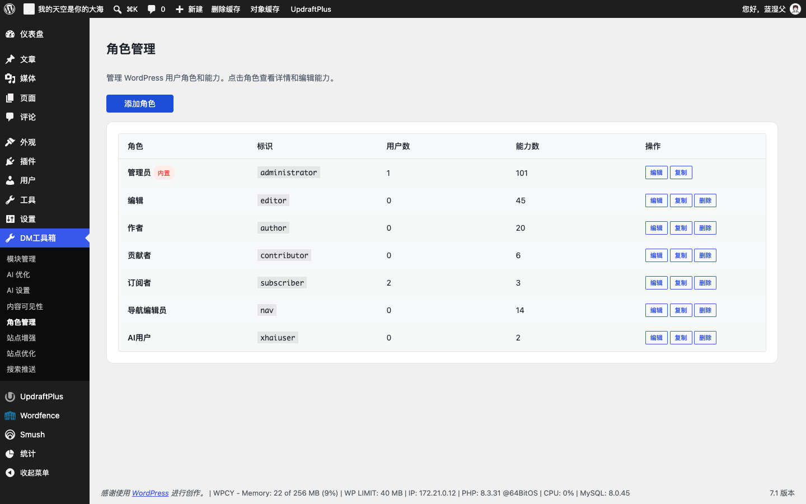
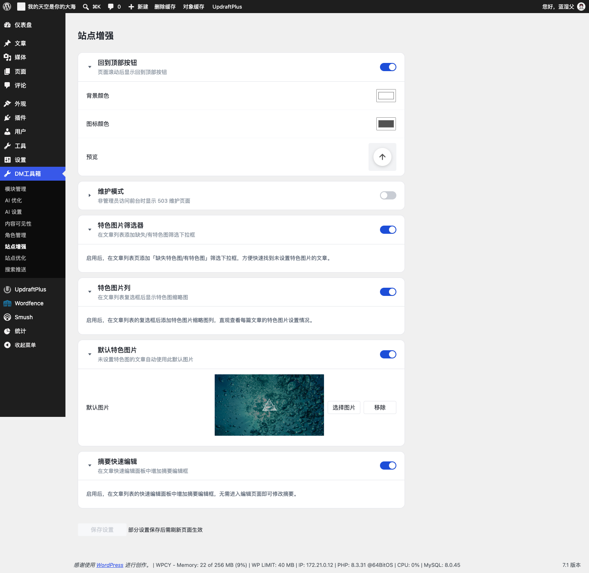
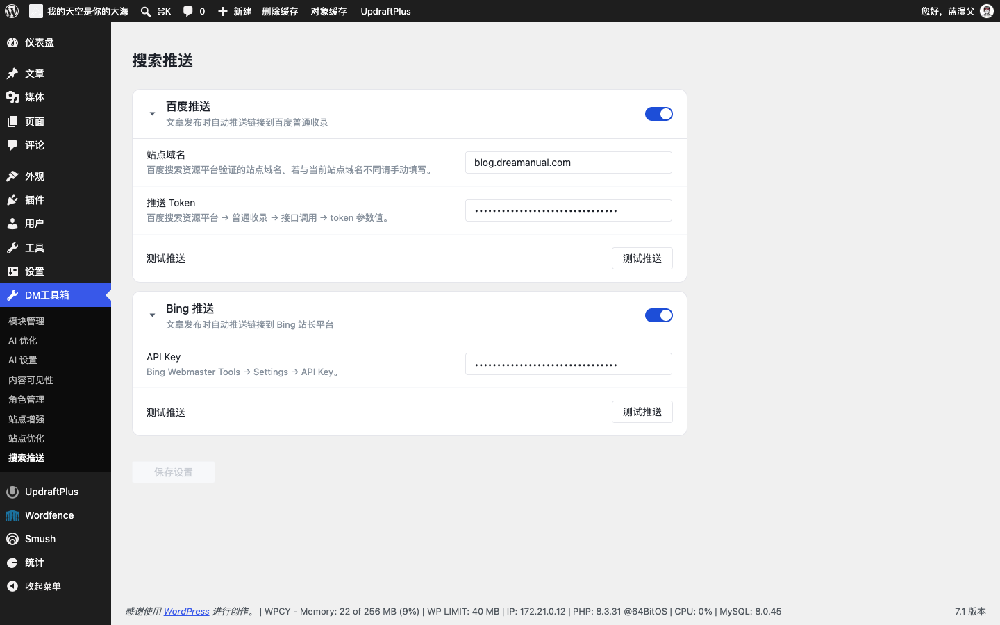
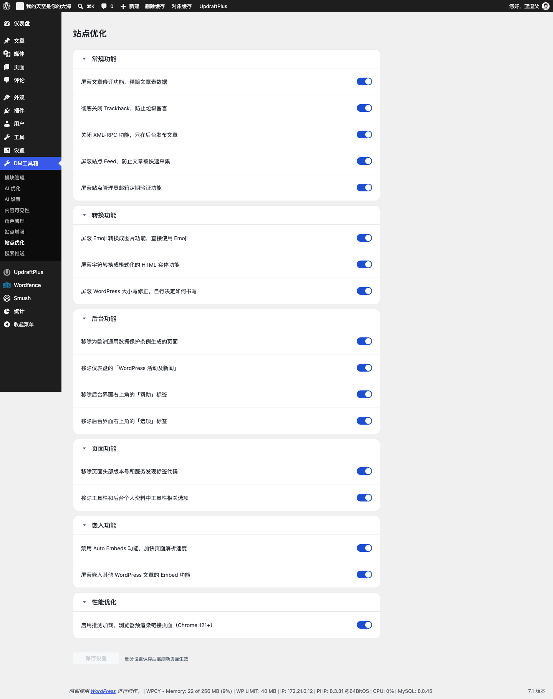

# Dreamanual Toolkit

模块化 WordPress 工具箱，将零散的小插件整合为一个插件。每个模块可独立开关，未启用的模块零开销加载。

## 功能特性

- **独立模块**：未启用的模块不加载任何代码、不注册任何 Hook
- **加密存储**：API Key 与 SMTP 密码使用 AES-256-CBC 加密，密钥由 `AUTH_KEY` + `SECURE_AUTH_KEY` 派生，数据库泄露也无法还原明文
- **原生 JS**：前端使用 Vanilla JS + CSS BEM 命名，仅 WordPress 核心要求处使用 jQuery
- **安全校验**：每个 AJAX 端点都经过 `check_ajax_referer` + `current_user_can` 双重验证
- **国际化**：文本域 `dreamanual-toolkit`，完整可翻译
- **缓存刷新**：前端资源版本使用 `filemtime()` 自动管理

### 模块列表

| 模块 | 功能 |
|------|------|
| AI Optimizer | AI 批量生成标签、Slug、摘要，支持多模型 |
| Content Visibility | 按分类控制内容可见性，支持渠道隐藏与角色绕过 |
| Role Manager | 精细的 WordPress 角色与权限编辑 |
| Site Enhance | 返回顶部、维护模式、特色图、评论头像、SMTP 邮件等增强 |
| Site Optimize | 16 项站点优化开关、中文排版、后台广告拦截 |
| Search Push | 发布/更新时自动向百度、必应提交文章链接 |


## 截图

### 模块管理



六个模块的启用与开关总览，每个模块可独立启用/停用。

### AI 优化



配置 AI 提供商（DeepSeek / OpenAI / Claude 等）、模型与 API Key，密钥加密存储。



批量选择文章，自动生成标签、Slug 与摘要。

### 内容可见性



按分类配置前端 / RSS / REST API / 搜索 / 站点地图等渠道的可见性，支持角色绕过与单篇隐藏。

### 角色管理



可视化查看与编辑角色权限，支持添加、复制、删除自定义角色。

### 站点增强



回到顶部、维护模式、特色图管理、SMTP 邮件等子功能独立开关。

### 搜索推送



配置百度与 Bing 推送，发布文章后自动提交链接。

### 站点优化



16 项优化开关，屏蔽冗余功能、提升站点性能与安全。

## 系统要求

- PHP 7.4+
- WordPress 6.4+

## 安装方式

1. 下载[最新版本](https://github.com/lantian-dreamanual/dreamanual-toolkit/archive/refs/heads/main.zip)或克隆仓库
2. 将 `dreamanual-toolkit` 文件夹上传至 `/wp-content/plugins/`
3. 在插件页激活 Dreamanual Toolkit
4. 进入「DM Toolkit → 模块管理」启用需要的模块

或使用 WP-CLI：

```bash
wp plugin install https://github.com/lantian-dreamanual/dreamanual-toolkit/archive/refs/heads/main.zip
```

## 模块详情

### AI Optimizer

使用 AI 模型自动为文章生成标签，支持 DeepSeek、OpenAI 等提供商，支持单篇与批量处理。

- 自动分析文章内容并给出标签建议
- 自定义 AI 模型与 API 端点配置
- 批量处理队列，避免超时
- API Key 加密存储

### Content Visibility

控制哪些内容对哪些受众可见。

- 按分类访问控制，隐藏渠道（前台/RSS/REST API/搜索/站点地图）
- 角色绕过：指定的登录角色仍可查看受限内容
- 单篇隐藏：一键隐藏单篇文章，直接链接返回 404

### Role Manager

精细的 WordPress 角色与权限管理。

- 可视化权限矩阵
- 创建、编辑、删除自定义角色
- 单权限开关
- 一键克隆角色

### Site Enhance

实用的前端与后台增强，每个子功能独立开关。

- **返回顶部**：自定义背景与图标颜色，实时预览
- **维护模式**：503 页面，管理员不受影响
- **特色图筛选**：按有/无特色图筛选文章
- **默认特色图**：无特色图文章的回退图片
- **快速编辑摘要**：文章列表快速编辑面板中的摘要字段
- **评论头像**：Gravatar 镜像源替换（如 cn.cravatar.com）加速加载；为未注册评论者设置自定义默认头像
- **SMTP 邮件**：可配置 SMTP 服务器，SSL/TLS 支持，密码加密，一键测试邮件

### Site Optimize

16 个优化开关 + 中文排版 + 后台广告拦截器，无需改代码。

- 禁用 Emoji、Embed、XML-RPC、REST API 等
- 禁用文章修订与自动保存
- 移除 WordPress 版本号与冗余 head 标签
- 禁用区块编辑器小工具
- 禁用后台邮箱验证
- Speculative Loading：使用浏览器 Speculation Rules API 预加载链接
- **中文排版**：中英文自动间距、两端对齐、智能引号、段落首行缩进
- **后台广告拦截器**：隐藏第三方插件推广与广告横幅，可编辑 CSS 选择器规则

### Search Push

发布/更新时自动向搜索引擎提交文章链接。

- **百度推送**：百度普通提交 API，可配置站点域名与 token
- **Bing 推送**：Bing Webmaster API，支持单条与批量提交
- 发布后延迟 30 秒推送，不阻塞发布
- 首次激活时自动迁移旧 `baidu-submit-link` 插件的设置

## 卸载

停用并删除插件会执行 `uninstall.php`，从数据库清理所有模块选项，不留残留。

## 项目结构

```
dreamanual-toolkit/
├── dreamanual-toolkit.php    # 插件入口
├── uninstall.php             # 卸载时清理
├── includes/
│   ├── class-core.php        # 核心模块调度器
│   ├── class-module.php      # 模块基类
│   └── class-ai-client.php   # AI 客户端 + 加密工具
├── modules/
│   ├── ai-optimizer/
│   ├── content-visibility/
│   ├── role-manager/
│   ├── site-enhance/
│   ├── site-optimize/
│   └── search-push/
├── assets/                   # 全局资源
└── languages/                # 翻译文件
```

## 开发者

蓝添 (Dreamanual)

## 许可证

GPL-2.0+
